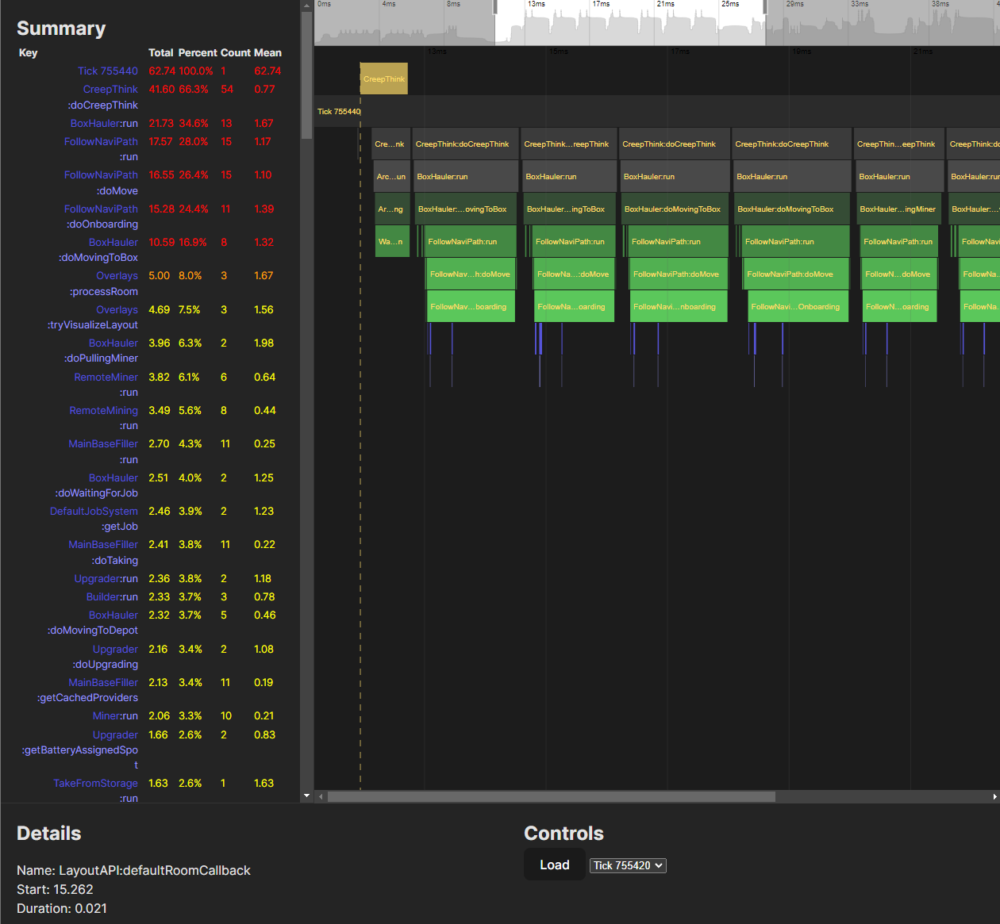

🍌 banan
=====

banan is an improved profiler for Screeps, which captures the call
tree of your bot and displays profiling information as a
[flame graph](https://www.brendangregg.com/flamegraphs.html)
in a frontend web view.

banan works by profiling your Screeps code using an `@profile` decorator applied
to any classes in your codebase that you wish to profile. This has
a compatible interface with the decorator from
[screeps-typescript-profiler](https://github.com/screepers/screeps-typescript-profiler).

The profiling information is saved to memory and can then be requested
over the Screeps API by the banan backend service, which is a Python app.

This history is served to a frontend app which uses [flame-chart-js](https://github.com/pyatyispyatil/flame-chart-js)
to render a flame graph in the browser.



instructions
-----

1. Add [bot/banan.ts](./bot/banan.ts) to your screeps bot and call it from your main loop. See [configuring the bot](#integrating-with-your-bot) below.
2. Deploy the update to your screeps bot and check that `Memory.BANAN` has been created. By default banan will write to the `BANAN` key in `Memory` but this can be configured by changing `autoSaveKey` (see below).
3. Create `backend/secrets.yml` with the credentials for your user on the screeps server you wish to profile (see `secrets.example.yml` for an example).
4. Run `docker compose up` to start the banan server + frontend.
5. Visit http://localhost:8080 to view the frontend.


integrating with your bot
---

Example of how to setup banan in your bot:

```typescript
import { Banan, profile } from "./profiler/banan";

// Add the profile decorator to every class you wish to profile.
@profile
class MinerRole {
    static run(creep: Creep) {
        // To mark important events you'd like to see on the profiling
        // timeline, you can add marks like this.
        Banan.instance.addMark("Run `${creep.name}`");
        ...
    }
}

// Banan must be initialized to tell it to save to memory on every tick
Banan.instance.init({ autoSaveKey: "BANAN" });

export const loop = () => {
  // Call startTick at the beginning of every tick to start recording
  Banan.instance.startTick();

  ...

  Banan.instance.endTick();
  Banan.instance.logInfo();
};
```
